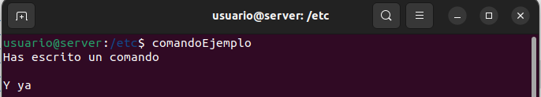

# Faketerminal
**Faketerminal** es una herramienta sencilla para generar terminales falsas.

## ¿Qué hace?
Permite simular una sesión de terminal personalizada en GNU/Linux, introduciendo:
- Un **nombre de usuario**
- Un **servidor**
- Un **directorio**
- Un **input de comando**
- Una serie de **líneas de comandos**
- Escribe "nada" para una línea vacía, y pulsa ENTER para el output.

## Uso
1. Clona el repositorio `git clone https://github.com/Luis06-py/faketerminal.git`
2. Ejecuta el script con `bash faketerminal.sh`

## Ejemplo de uso
```bash
$ bash faketerminal.sh
Username: usuario
Servidor: server
Directorio (dejar vacío para ~): /etc
Input: comandoEjemplo
> Has escrito un comando
> nada
> Y ya

usuario@server:/etc$ comandoEjemplo
Has escrito un comando

Y ya
```


## ¿Por qué harías tal cosa?
No lo sé, pero si llegaste aquí, probablemente ya tienes tus razones.
